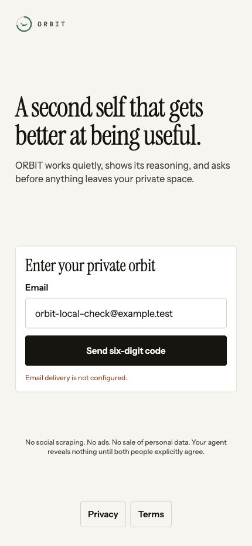

# ORBIT Pass 5 verification and handoff

Evidence date: Friday, October 9, 2026. Target dates: founder iPhone Saturday, October 10; roughly 25 invited users Monday, October 12. This report concerns the limited beta, not public store submission.

## Decision

**The code is running locally. The requested deployed, installed-iPhone release is not delivered and is not verified. Do not invite the cohort yet.**

Local web: <http://localhost:8081/sign-in>. Local API: <http://127.0.0.1:4100>. API `/health`, `/ready`, and legal pages answer locally. The API and worker were built and their compiled entry points were started. PostgreSQL with pgvector and Redis are reachable locally. The worker registers its schedules; its local daily model caps are intentionally zero to prevent unattended paid calls during this handoff.

The visible sign-in screen was checked at 375×667 and 430×932 browser viewports. Sending a code with email delivery absent shows **“Email delivery is not configured.”** It stays on the screen with an available action and does not reveal a code. There is no sign-in bypass added for UI exploration. Until Resend is configured, the founder can see the local sign-in UI but cannot use real email authentication.

GitHub access works. Railway authentication was unavailable, EAS was not logged in, and this workspace lacks the production Resend, Google OAuth, Sentry, Expo/Apple settings needed for the remaining work. An OpenRouter key did support the bounded real-model evaluation below. A provider key is not deployment or signing authority.

There is **no verified deployed API URL**, no external-network `/ready` proof, no successful EAS build URL, no TestFlight installation, and no APK installation in this pass. No public App Store/Play submission, payment feature, or GitHub/club feature was started.

Two high-severity dependency advisories remain with no published patched versions in the checked registry. The audit gate still fails. Public distribution needs those resolved or independently assessed and mitigated, not ignored.

## The deciding ten checks

The request requires these against a deployed backend, a wiped unseeded deployment database, and physical phones. That environment does not exist here. **FAIL — UNVERIFIED** means the required release check was not run; it does not mean a local substitute proves the feature broken. No development database was wiped to imitate production evidence.

| #   | Required release check                                          | Result            | What actually happened locally / what remains                                                                                                                                                                                                                          |
| --- | --------------------------------------------------------------- | ----------------- | ---------------------------------------------------------------------------------------------------------------------------------------------------------------------------------------------------------------------------------------------------------------------- |
| 1   | New account through real email OTP, code only in email          | FAIL — UNVERIFIED | API tests exercise OTP attempts, cooldown, one-time consumption, age gate, and account limits using an explicit test-only adapter. Live web correctly reports missing delivery. No real email arrived. Verify Resend domain and send to founder plus a second mailbox. |
| 2   | Interview → name agent → Today                                  | FAIL — UNVERIFIED | Mobile test restores saved interview question and draft. API tests verify a completed named account reports onboarding complete. No fresh installed-iPhone journey or fresh-install returning-user run.                                                                |
| 3   | Google consent → real sync → real Catch/source links            | FAIL — UNVERIFIED | OAuth status/progress, expiry handling, source construction, and Gmail body-retention changes are implemented. No real Google grant, mailbox read, installed deep link, or source-opening run.                                                                         |
| 4   | Second account, shared intent, match, transcript, mutual reveal | FAIL — UNVERIFIED | Local API integration verifies two-sided consent and protected redaction-failed content. Ten synthetic pairs use real models. No two-device deployed reveal or phone transcript QA.                                                                                    |
| 5   | Airplane mode: every screen honest, no invented data            | FAIL — UNVERIFIED | Account-scoped offline-cache tests and query-state source checks pass. No physical airplane-mode sweep across all 45 routes.                                                                                                                                           |
| 6   | Kill API: same honest degradation                               | FAIL — UNVERIFIED | Error-state/mobile tests pass and local sign-in delivery failure is visible. No deployed outage or all-screen run.                                                                                                                                                     |
| 7   | Deliberate cost cap, plain-language notice                      | FAIL — UNVERIFIED | Router and database integration tests reject before provider calls, including concurrent allowance claims. UI/worker cap messages are implemented. No cap demonstration in the signed release.                                                                         |
| 8   | Deletion request, countdown, cancellation                       | FAIL — UNVERIFIED | Local API integration verifies scheduled deletion and cancellation. No installed-iPhone button/confirmation/countdown test.                                                                                                                                            |
| 9   | Export profile, verify signature                                | FAIL — UNVERIFIED | Local API integration downloads the archive, verifies the signature using the correct signing secret, and rejects a wrong secret. No deployed export inspected on the founder's device.                                                                                |
| 10  | No on-screen OTP, seed path, or test bypass in release          | FAIL — UNVERIFIED | Production configuration tests reject development flags/log delivery/stub routes. Old fixed-code challenge removed by migration. Live mobile UI displays no OTP. No inspection of the actual signed production binary/deployment.                                      |

Run this matrix again after the infrastructure and native builds exist. Record the actual URLs, build identifiers, devices, timestamps, evidence, and pass/fail results. Issues [#13](https://github.com/Hetul803/ORBIT/issues/13), [#14](https://github.com/Hetul803/ORBIT/issues/14), [#15](https://github.com/Hetul803/ORBIT/issues/15), and [#23](https://github.com/Hetul803/ORBIT/issues/23) track those prerequisites and checks.

## Part A — production behavior and privacy boundaries

### A1. Development shortcuts found and changed

| File(s)                                                                                                        | Earlier behavior / risk                                                                                                               | Change and verification                                                                                                                                                                                                                                                                                                                                                                                                                   |
| -------------------------------------------------------------------------------------------------------------- | ------------------------------------------------------------------------------------------------------------------------------------- | ----------------------------------------------------------------------------------------------------------------------------------------------------------------------------------------------------------------------------------------------------------------------------------------------------------------------------------------------------------------------------------------------------------------------------------------- |
| `apps/api/src/config.ts`, `routes/auth.ts`                                                                     | Development OTP could be returned based mainly on environment/adapter mode; an absent provider could look usable.                     | Explicit `ALLOW_DEVELOPMENT_OTP_DISPLAY` is off by default. Production rejects it and email/phone log adapters. Missing delivery returns an error. Production config tests and live missing-email UI check pass.                                                                                                                                                                                                                          |
| `apps/mobile/app/(auth)/sign-in.tsx`, `app/verification.tsx`                                                   | Client could display/use development OTP returned by the server.                                                                      | Display/autofill removed from mobile. The client does not use `developmentCode`. Wrong/expired/limited/offline states have messages; resend waits 30 seconds. Physical keyboard/network/accessibility behavior is unverified.                                                                                                                                                                                                             |
| `packages/db/src/seed.ts`                                                                                      | Fixed seed OTP and a permissive seed entry point.                                                                                     | Stable challenge creation removed. Seed requires an explicit development flag and refuses production. Migration `202610090013_remove_legacy_seed_otp/migration.sql` deletes the old `seed-demo-otp` row. API startup does not seed.                                                                                                                                                                                                       |
| `packages/llm/src/router.ts`, `apps/api/src/config.ts`, `apps/worker/src/config.ts`                            | Stub provider/model could remain reachable through configuration/fallback.                                                            | Production refuses stub primary and fallback providers/models; model-route config and router tests cover it. Stub remains only for explicit development/testing.                                                                                                                                                                                                                                                                          |
| `apps/mobile/app/introduction/[id].tsx`, `tests/core-flows.test.tsx`, `tests/query-states.test.ts`             | Earlier fabricated-introduction concern from the audit.                                                                               | Current screen uses authoritative query results and has no fabricated signed-out record fallback. Runtime test covers the error case; source checks cover the empty/error pattern. This is not a runtime sweep of every screen.                                                                                                                                                                                                           |
| `apps/mobile/src/api.ts`, `offline.ts`, new `offline-scope.ts`, `store.ts`, `app/_layout.tsx`                  | Cache and queued writes could survive sign-out or cross to a different user's credentials.                                            | Cache/queue names now include an account namespace derived from JWT subject solely for local partitioning. Signed-out reads cannot use an account cache. Queue entries do not retain Authorization/Cookie. Scope checks prevent late writes/replays into another account. Sign-out cancels/clears query data and removes ORBIT offline/onboarding/auth storage. New cache tests pass. Server authorization remains the security boundary. |
| `packages/db/prisma/migrations/202610090012_budget_reservations/migration.sql`, `apps/api/src/routes/gmail.ts` | Older Gmail source rows retained body/snippet and inbox text.                                                                         | Migration clears old Gmail body/snippet and inbox body/agent reply. New Gmail sync parses text transiently, stores empty source bodies and bounded derived signals. Calendar descriptions are separately retained and disclosed. Real mailbox audit is unverified.                                                                                                                                                                        |
| `apps/api/src/app.ts`, `packages/shared/src/telemetry.ts`                                                      | Raw URL/query/context logging could expose OAuth codes, share tokens, or user text; inbound request IDs could be attacker-controlled. | Server generates UUID request IDs, logs route templates, not raw URLs/query, and emits generic exception metadata. Shared Sentry scrubber removes private request/user/context/message/span data. Scrubber tests pass; live three-service Sentry events still unverified.                                                                                                                                                                 |
| `apps/worker/tsconfig.json`                                                                                    | Build emitted `dist/apps/worker/src/index.js` while start expected `dist/src/index.js`.                                               | Root directory fixed. Actual compiled worker entry exists and was started locally. This would have broken deployment despite a successful TypeScript build.                                                                                                                                                                                                                                                                               |

Seed fixtures and explicit test adapter values remain in test/development code; they are not real accounts or production credentials. They are not removed merely to make a search result empty. Production boot refuses the flags enabling them. The adaptive interview's fixed fallback questions are legitimate questions, not invented user facts. Fallback notices explain model unavailability/cost limits.

`apps/mobile/app.json` also removes an unimplemented microphone declaration on iOS and explicitly blocks Android microphone, legacy broad-storage and overlay permissions. Android generation had added the storage/overlay entries through templates/packages. Regeneration with Expo's supported blocking configuration was checked for removal directives and no active entries for those permissions. This is prebuild inspection, not proof of the final merged APK.

### A2. Secrets and fail-fast configuration

Fresh JWT access, JWT refresh, field-encryption, and export-signing values were generated into ignored `.env.production.local` with owner-only file permissions (`0600`). The generator uses cryptographic randomness and refuses to overwrite an existing file. These values have **not** been installed into Railway. Do not reuse the development values or use the same value for separate secrets.

`git check-ignore -v .env .env.production.local` names `.gitignore` entries 6 and 7. No private provider key or signing secret is assigned to an `EXPO_PUBLIC_*` variable. Public API/WS URLs, the Expo project ID, and the mobile Sentry DSN are public bundle configuration; Sentry's upload token is private and is not public configuration.

API/worker configuration rejects missing production secrets, local database/Redis URLs, non-HTTPS API configuration, log adapters, development flags, missing Sentry DSN, absent real-model credentials, and incomplete Google settings when Google is enabled. Production service startup additionally requires Sentry release-upload settings. Tests cover representative missing/unsafe settings, not every provider/account permutation.

The credential scan compares tracked content and the inspected Git history against the locally configured private provider-key values without printing them, searches private-key/token signatures, and checks public-variable names. See Delivery evidence below for the final scan scope. This is not a claim that an automated pattern scan can discover every possible historical secret; an independent repository-secret scan is still sensible before a public release.

### A3. Abuse and model spending

- OTP request limits apply by email and hashed IP, with a 30-second resend delay. Failed attempts consume the per-code attempt allowance; a correct code is atomically claimed once. Two concurrent correct verifies produce one success, not two sessions/accounts.
- Account creation rechecks admission under a PostgreSQL advisory lock. Defaults are five new accounts per IP per day and 50 accounts for the deployment. They are configurable. Test cases exercise per-IP and total-cap rejection.
- An under-18 verification consumes its challenge and creates age-gate evidence. Replaying that challenge or asking for another code and changing the birth date does not bypass that recorded rejection. This prevents those replay paths; self-declared birth dates are not independent identity/age verification.
- Primary calls, retries, and fallbacks acquire a cost reservation before making a provider call. Embeddings also reserve/record usage. User/global checks count recorded calls plus active daily reservations under a database lock, preventing simultaneous calls from both spending the same allowance.
- Success settles usage and deletes the reservation in one transaction. Failure or an ambiguous provider result keeps the reserved allowance until the next UTC day. This favors stopping spending over falsely freeing an allowance. Reserved amounts are not invoices.
- Estimates include UTF-8 prompt bytes, message overhead, tools, configured output maximum, and route prices. Embedding pricing uses an operator-configured conservative rate. Budget safety depends on configured prices/output limits being at least the actual provider charges; credits, unreported provider usage, and catalog changes need reconciliation.
- Worker cost failures receive a paused-cost-cap state and plain-language user notice. Other provider failures are not mislabeled as a successful/no-match run. Circle explains both those cases.
- Trusted proxy handling is not proven on Railway. Forwarded headers are ignored by default; only explicitly verified ingress IPs/CIDRs can be trusted. Broad trust-all values are rejected. If a shared proxy IP is used, unrelated users may share one signup allowance. Test forged headers plus two independent networks before inviting people. [#33](https://github.com/Hetul803/ORBIT/issues/33)

### A4. Observability

HTTP responses return `x-request-id`; the ID is threaded into activities, queued work, and model-call records. API/worker logs use event names, safe metadata, route templates, job IDs, and generic error names. Redaction diagnostics contain category/pattern/turn/source identifiers but not original text.

API, worker, and mobile use the shared Sentry scrubber. It removes user/request/extra/context payloads, private breadcrumbs, arbitrary tags, raw exception messages and frame variables, and span descriptions/data; safe release/service/request-ID metadata and source frames remain. Four source-map startup tests cover development skip, missing production settings, injection-before-upload ordering, and failed CLI execution with mocked execution. Those are **not** evidence of a real Sentry upload or symbolicated crash.

API/worker start scripts inject debug IDs and upload source maps before starting in production; missing upload settings or a failed upload stop boot. Railway Docker contexts include the scripts. Mobile already has the Sentry Expo plugin/Metro setup; private EAS settings and a signed build must still prove it. [#22](https://github.com/Hetul803/ORBIT/issues/22)

## Part B — flow, button, and API changes

The following describes implemented behavior and its evidence, not a claim that every button has been exercised on a device.

| Surface / action                             | What it does and backing behavior                                                                                                                                                                                                                                                                 | Evidence / limit                                                                                             |
| -------------------------------------------- | ------------------------------------------------------------------------------------------------------------------------------------------------------------------------------------------------------------------------------------------------------------------------------------------------- | ------------------------------------------------------------------------------------------------------------ |
| Sign-in: **Send six-digit code**             | Requests `/v1/auth/otp/request`; bounded network wait; no fake success or code if delivery is absent.                                                                                                                                                                                             | Live local error checked. Real delivery blocked by Resend.                                                   |
| OTP: verify / resend                         | `/v1/auth/otp/verify` atomically consumes correct code; attempt/cooldown/rate limits; resend becomes available after 30 seconds.                                                                                                                                                                  | API integration passes. Installed flow, delayed email and airplane-mode behavior unverified.                 |
| Age gate                                     | Verifies eligibility before admitting a new account; records rejected attempt to stop replay/revised-DOB retry.                                                                                                                                                                                   | Replay test passes; no claim of document-based age proof.                                                    |
| Interview: answer / continue                 | Persists session, question index, answers, draft answer, extracted facts, and draft agent name locally. Saves durable answer before optional embedding work. If embedding fails, completion continues with a semantic-index-paused notice rather than duplicating the answer through a 500 retry. | Restore test passes; killed native app at question four unverified.                                          |
| Name agent / return to app                   | `Agent.onboardingCompletedAt` distinguishes placeholder creation from completed onboarding. Naming marks completion; auth hydration routes unfinished users back to the interview and completed users to the app.                                                                                 | Completed-account API assertion and mobile restore test pass; fresh-install returning user unverified.       |
| Connections: **Connect Google read-only**    | One Google Web OAuth grant requests both Gmail and Calendar read-only. Plain-language copy states what is read/stored. Single-use state is consumed on success/failure. Deep link returns to `orbit://connections`.                                                                               | Code implemented; no actual installed grant.                                                                 |
| Connections: cancel / denied scope / retry   | Distinguishes cancelled, incomplete scope, callback failure, connected, and reconnect states. Missing Google configuration is explained instead of showing a working-looking connection.                                                                                                          | Real cancellation, backgrounding, network-loss and single-scope denial remain unverified.                    |
| Connections: sync / retry                    | Stores sync phase and counts, polls about every 1.5 seconds, shows mail/Calendar/Catch stages. Normal requests time out at 30 seconds; sync has a bounded 20-minute allowance. `invalid_grant` marks the connection expired and prompts reconnection.                                             | Real first-sync timings/counts and seven-day expiry unverified.                                              |
| Catch: **Open original**                     | Opens stored Gmail/Calendar source URLs. No padding records for an empty Catch. Displays stale/reconnect context and last sync.                                                                                                                                                                   | Source constructors and existing tests execute locally; actual founder email/event opens not tested.         |
| Catch: dismiss                               | `POST /v1/life/catch/:id/dismiss` changes the owned item to dismissed and logs metadata.                                                                                                                                                                                                          | Persisted implementation; full native button flow unverified.                                                |
| Catch: snooze                                | `POST /v1/life/catch/:id/snooze` stores a future timestamp; item returns when that time is reached. Past times rejected.                                                                                                                                                                          | Implementation exists; device clock/overnight UI flow unverified.                                            |
| Catch: copy draft                            | Copies to clipboard and posts `/v1/life/catch/:id/copied`; the persisted timestamp gives a copied receipt after reload. It never sends email.                                                                                                                                                     | New persistence/API/UI added; real clipboard and provider-derived draft unverified.                          |
| Today: Catch count / route                   | Shows actual Catch count and routes to Catch, rather than manufactured items.                                                                                                                                                                                                                     | Existing implementation retained; deployed freshness/navigation unverified.                                  |
| Circle: empty / retry                        | Explains that matches need another person, shared intent, and overnight execution. Shows cost-cap or provider-failure explanation and retry when applicable.                                                                                                                                      | Source/mobile tests; no real-user overnight cohort yet.                                                      |
| Introduction: transcript / reveal            | Uses safe authoritative transcript, never raw failed-redaction text; both parties must consent before contact reveal.                                                                                                                                                                             | Two-account local integration and mobile error test pass; phone typography and two-device reveal unverified. |
| Memory: forget                               | Confirmation precedes memory deletion.                                                                                                                                                                                                                                                            | New confirmation; native action-sheet interaction unverified.                                                |
| Settings: export / request deletion / cancel | Signed archive export and seven-day deletion countdown/cancellation; legal links added.                                                                                                                                                                                                           | API signature/countdown/cancel assertions pass. Full device UI test remains.                                 |
| Sign out                                     | Removes tokens, pending local onboarding, cached resources and queued writes; cancels in-flight queries. Does not replay one account's queued mutation under another account.                                                                                                                     | Storage/scope tests pass.                                                                                    |
| Privacy / Terms / Support                    | Public API HTML endpoints; buttons on sign-in and Settings. Documents describe this app's actual data and controls.                                                                                                                                                                               | Local legal routes return 200; public owned-domain deployment absent.                                        |

Gmail message body parsing is transient. Retained derived categories are bounded signals such as `needsReply`, `commitment`, `dateMention`, and `renewal`; source body is blank. The draft does not pretend to quote an unretained message. Calendar event descriptions are retained up to 8,000 characters and explicitly disclosed, unlike Gmail message bodies.

**B5 is incomplete.** Not every screen has been manually walked, not every loading state has a content-shaped skeleton, not every list is virtualized, and back-navigation/destructive-action behavior has not been exhaustively tested. Source checks are not physical runtime checks. The small/large sign-in viewport test does not prove every serif headline fits. Track [#9](https://github.com/Hetul803/ORBIT/issues/9) and [#23](https://github.com/Hetul803/ORBIT/issues/23).

## Part C — real-model matching evaluation

### Method and limits

`apps/worker/scripts/pass5-evaluate.ts` was executed in an isolated local `orbit_pass5_eval` database with the ten synthetic people used by the earlier cohort. These are synthetic profiles, not the founder's Gmail, live friends, or evidence of good real-world relationships. The script refuses production. It evaluated ten deliberately selected pairs with real OpenRouter-backed calls, strict redaction, and judging.

Persona instructions require an own-user constraint/concern/difference and forbid opening by praising or restating the other agent. Early conversation termination is blocked until both sides have surfaced constraint tension. The judge explicitly penalizes pure agreement; the no-tension heuristic caps the score at 49 and records `insufficient_tension`. This does not force the model to invent a difference when profiles overlap.

| Pair          | Status                      | Score | Recorded model cost, cents |
| ------------- | --------------------------- | ----: | -------------------------: |
| Mara / Owen   | Completed, redaction passed |    66 |                    0.90388 |
| Diego / Priya | Completed, redaction passed |    50 |                    0.89136 |
| Aisha / Sofia | Completed, redaction passed |    62 |                    0.96800 |
| Ben / Cal     | Completed, redaction passed |    15 |                    0.90344 |
| Leila / Noah  | Completed, redaction passed |    58 |                    0.97104 |
| Mara / Leila  | Completed, redaction passed |    68 |                    0.87792 |
| Owen / Ben    | Completed, redaction passed |    68 |                    0.87012 |
| Diego / Cal   | Completed, redaction passed |    30 |                    0.93628 |
| Priya / Sofia | Completed, redaction passed |    68 |                    0.97016 |
| Aisha / Noah  | Completed, redaction passed |    66 |                    0.99800 |
| **Total**     | **10/10 completed**         |     — |                **9.29020** |

That is approximately **$0.092902 for this run**, not the cost of operating the company for 100 users. Hosting, Google review/security work, retries, mailbox volume, interactive use, Apple fees, and other providers are not in that number. Prior cost-planning assumptions are in `docs/PROVIDER_SETUP_AND_COSTS.md`; they must be refreshed against actual beta use and current provider prices before budgeting a larger launch.

### Redaction before and after

| Run                          | Failure rate      | Cause distribution                                                                                                                                                                                               |
| ---------------------------- | ----------------- | ---------------------------------------------------------------------------------------------------------------------------------------------------------------------------------------------------------------- |
| Pass 4 historical evaluation | 7/19 = **36.84%** | Seven redaction failures. Pattern, turn and category were not retained then, so all seven are historically unclassified. The old data cannot establish identifying leakage versus harmless-text false positives. |
| Pass 5 bounded evaluation    | 0/10 = **0%**     | Zero pattern-triggered, detector-triggered, or post-redaction failures observed in this ten-pair sample. All ten passed the strict gate.                                                                         |

Failures now produce `safeRedactionFailure` metadata: category, matched pattern label, source stage, turn index, and request identifier, never the text. Regex checks precede and follow model redaction. Failed/uncertain privacy checks still stop the conversation; raw content is not substituted into a user transcript.

The observed sample is under the 10% target, but **zero failures in ten runs is not a privacy guarantee or evidence that the historical root cause is solved**. Narrowing a detector without historical evidence would be guesswork, so the gate was not weakened. Further adversarial evaluations and classified failures remain [#30](https://github.com/Hetul803/ORBIT/issues/30).

### Three verbatim transcripts

These are the stored redacted synthetic transcript texts. Names label synthetic personas. Paragraphs are copied verbatim, not rewritten to make the exchanges look better.

#### 1. Mara / Owen — score 66

Conversation `cmv0r60jn001zshshatyal17u`.

1. **Mara:** Do you prefer quiet, uninterrupted mornings for your personal activities, or are you comfortable with noise and distractions during that time?
2. **Owen:** My user works early library shifts, so mornings are often busy and structured. Large or last-minute gatherings drain their energy, which might make spontaneous plans difficult. Do you usually prefer to plan social activities well in advance, or are you okay with last-minute invitations?
3. **Mara:** My user needs uninterrupted quiet mornings for transit-map sketching, so busy or noisy mornings would be a problem. Also, they value predictable plans and reliable follow-through, so last-minute invitations are usually not a good fit. How do you usually handle changes in plans or cancellations?
4. **Owen:** My user protects a weekly museum sketchbook hour, which requires a steady, low-key commitment. They also prefer one unhurried coffee with a friend rather than large group hangouts. Given this, how do you feel about keeping social plans small and calm, with clear agreements made ahead of time?
5. **Mara:** My user avoids crowded or loud events and needs time to think before committing to plans. This means last-minute changes or noisy group activities would be difficult. Does your user also prefer to have time to consider plans before agreeing, or do they tend to decide quickly?
6. **Owen:** My user definitely prefers to have time to consider plans before agreeing. They also find large or last-minute gatherings draining. How does your user recharge after social time? Do they need quiet alone time, or do they prefer to stay engaged with others?
7. **Mara:** My user needs uninterrupted quiet mornings for focused sketching, so any early socializing or noise would disrupt that. This is a key constraint. Does your user have any morning commitments that require quiet or solitude?
8. **Owen:** My user’s early library shifts require quiet mornings for rest beforehand. They recharge best with calm, solo time after socializing. Does your user also need solitude to recharge, or do they prefer more social interaction afterward?

Judge: “The two have compatible low-key, planned social styles and mutual morning constraints, but the exchange shows little real disagreement and leaves A's recharge needs unanswered.”

Assessment: both state practical constraints and the judge penalizes the lack of tension. **This is still mostly mirrored preference, not strong disagreement.** Questions are repeated or left unanswered. The prompt change did not fully solve conversation quality.

#### 2. Diego / Priya — score 50

Conversation `cmv0r6lxb002qshshz5rb0itd`.

1. **Diego:** How do you usually handle plans when they remain undecided for a while?
2. **Priya:** My user needs plans set at least three days in advance. Last-minute or undecided plans are tough for them. How do you feel about making plans on short notice, especially during a busy week?
3. **Diego:** My user loses momentum when plans stay undecided, which can make last-minute changes frustrating. Since your user prefers plans set well in advance, how do they handle spontaneous activities like pickup games or quick food runs?
4. **Priya:** My user has little room for spontaneous weekday plans due to a graduate deadline and needs to protect long deep-work blocks. This means last-minute invites or unplanned activities during the week are usually off the table. Does your user also need quiet, structured breaks during work or study time?
5. **Diego:** My user trains for an outdoor climbing trip in six months and boulders three times a week, so their schedule often revolves around these sessions. This might limit flexibility for spontaneous plans, especially if they conflict with training. How does your user balance their priorities when unexpected opportunities for social activities come up?
6. **Priya:** My user’s biggest concern is protecting long, uninterrupted deep-work blocks for a graduate deadline, which means they avoid loud or competitive activities and need quiet, structured breaks. This might conflict with your user’s climbing training schedule if it demands flexible or spontaneous time. How does your user usually adjust their training or social plans when unexpected academic or work deadlines arise?
7. **Diego:** My user prefers quick, direct decisions to keep momentum, especially around training and climbing prep. If your user’s work deadlines require strict focus and limit spontaneous plans, how do they feel about committing to social activities that need firm scheduling weeks ahead? Would that work with their need for quiet, structured breaks?
8. **Priya:** My user needs plans set at least three days in advance and values quiet, structured breaks. If social activities require firm scheduling weeks ahead, that fits well. However, my user dislikes loud or competitive environments. Does your user avoid those kinds of activities too, or are they comfortable with more energetic, noisy settings?

Judge: “Both sides state real constraints and agree on committing to plans in advance, but differences in pace, energy and activity style are unresolved.”

Assessment: **real differences appear** around spontaneity, time pressure, quiet versus energetic activities. They are not resolved; the agents still ask more than they answer. This is useful evidence of compatibility uncertainty, not a successful introduction by itself.

#### 3. Aisha / Sofia — score 62

Conversation `cmv0r777i003hshsh2e5eih6j`.

1. **Aisha:** Do you have fixed weekly commitments, like music rehearsals or family calls, that you do not reschedule?
2. **Sofia:** My user keeps one screen-free evening each week. This might limit evening plans involving phones or computers. How do you usually handle evenings with friends?
3. **Aisha:** My user keeps fixed music-rehearsal and family-call commitments that they do not reschedule. Would your user be comfortable with plans that cannot change last minute?
4. **Sofia:** My user can reschedule plans if communication is early and kind, but they avoid high-pressure social plans. This might be a difference if your user expects last-minute changes or strong social pressure. Does your user enjoy attending affordable community classes or farmers markets, or prefer different social activities?
5. **Aisha:** My user prefers to avoid last-minute schedule changes entirely. How does your user feel about volunteering activities that require consistent attendance alongside a friend?
6. **Sofia:** My user likes affordable community classes and farmers markets but prefers low-pressure social settings. Volunteering with consistent attendance might work if it’s not too demanding or high-pressure. Does your user enjoy cooking for friends or sharing activities like beginner yoga? That’s a key part of my user’s social life.
7. **Aisha:** My user enjoys shared creative work with equal participation, such as music or art projects. How important is it for your user to have balanced involvement in joint activities?
8. **Sofia:** My user cooks for friends and teaches beginner yoga, which involves sharing skills and attention. Would your user be comfortable with social activities where one person leads or teaches and the other follows? Also, does your user prefer quiet, relaxed settings over more active or noisy ones?

Judge: “Both sides state real constraints and a few tradeoffs, and shared low-pressure interests make a match plausible, but participation style and flexibility remain unresolved.”

Assessment: **real differences appear** around fixed versus flexible plans and equal participation versus teacher/follower roles. The unresolved questions still limit usefulness. [#34](https://github.com/Hetul803/ORBIT/issues/34) tracks improving answering, tradeoff exploration and repeated constraints; a billion-dollar outcome or retention cannot be inferred from this sample.

## Part D — deployment, build, and distribution status

| Requirement                                   | Status                                                                                                                                                                    |
| --------------------------------------------- | ------------------------------------------------------------------------------------------------------------------------------------------------------------------------- |
| Railway API/worker and managed pgvector/Redis | Dockerfiles, migration predeploy and readiness config prepared. No authenticated deployment or public URL.                                                                |
| Migrations on deploy                          | Railway config runs `prisma migrate deploy`. All 13 migrations applied locally; not to a new deployed database.                                                           |
| External HTTPS proof                          | None. Local loopback 200 responses are not external-network evidence.                                                                                                     |
| Google project/API/client/test user           | Consent/callback code and exact steps prepared. No founder account setup or real installed consent.                                                                       |
| EAS project / environment / signing           | Dynamic config reads project ID from environment, not a committed UUID. Expo login/project/signing settings absent.                                                       |
| iOS TestFlight build                          | No signed build, upload, processing result, invitation, or installation. Version `0.1.0`, iOS build `1`, bundle `com.orbit.companion`, phone-only configuration prepared. |
| Android APK                                   | Preview profile configured for an internal APK, version code `1`. No build/download/installation proof.                                                                   |
| Expo Updates                                  | Environment-controlled project configuration, preview/production channels and `appVersion` runtime policy prepared. No signed runtime or OTA update tested.               |
| Sentry release                                | Scrubber and upload-before-start implemented/tested locally. No real server/mobile upload or readable event.                                                              |

### Founder actions, in order

The full button-by-button instructions, including Android warning wording, are in `docs/LAUNCH_CHECKLIST.md`. The immediate order is:

1. **Resend → Domains → Add Domain**, publish the displayed DNS records, then **Verify DNS Records**. **API Keys → Create API Key**; install the sending key and verified From address in Railway. This is the real-email blocker for Monday; no code change can verify your DNS or own a mailbox for you. [#24](https://github.com/Hetul803/ORBIT/issues/24)
2. **Railway → New Project → Deploy a Template** for pgvector; **New → Database → Add Redis**; add two **GitHub Repo** services, configure `/infra/railway/api.json` and `/infra/railway/worker.json`, add private/reference variables, then **Deploy**. Generate API domain under **Settings → Networking**. Confirm `/ready` over cellular and trusted-ingress limits. [#13](https://github.com/Hetul803/ORBIT/issues/13), [#33](https://github.com/Hetul803/ORBIT/issues/33)
3. **Google Cloud → APIs & Services → Library → Enable** Gmail and Calendar. **Google Auth Platform → Branding**, **Data Access**, **Clients → Create Client → Web application**. Register exactly `https://<API_DOMAIN>/v1/connections/gmail/callback`, add both read-only scopes, then **Audience → Test users → Add users**. Install the private client settings in Railway. [#15](https://github.com/Hetul803/ORBIT/issues/15)
4. **Sentry → Projects → Create Project** for API, worker and mobile; **Developer Settings → Internal Integrations → Create New Integration** for upload permissions. Put private tokens/project settings in Railway/EAS, public mobile DSN only in `EXPO_PUBLIC_SENTRY_DSN`. Verify readable, scrubbed errors in all three. [#22](https://github.com/Hetul803/ORBIT/issues/22)
5. **Expo → Projects → Create a project**, authenticate EAS, and set production/preview environment variables to the deployed HTTPS/WSS domain and project UUID. Run the checked-in production iOS and preview Android profiles. Build/signing authority belongs to your Expo/Apple accounts. [#14](https://github.com/Hetul803/ORBIT/issues/14)
6. **App Store Connect → Apps → + → New App**; EAS Submit uploads to TestFlight. **ORBIT → TestFlight → Internal Testing → + → Create New Group**, **Add Builds**, **Add Testers**. Install from TestFlight on your iPhone. Internal tests do not require Beta App Review. [Apple internal testing](https://developer.apple.com/help/app-store-connect/test-a-beta-version/add-internal-testers)
7. Run all ten deciding checks above before distributing. Record small/large device UI, real Google cancellation/deep link/reconnect, source opens, two-device reveal, offline, cap, deletion and signed export. [#23](https://github.com/Hetul803/ORBIT/issues/23)
8. Saturday: **TestFlight → External Testing → +**, create friends group, **Add Builds**, fill Test Information and private reviewer OTP access, then **Submit for Review**. Only after approval use **Enable Public Link**, capped around 30 testers. A first external build needs Beta App Review; its turnaround is not a promise. [#26](https://github.com/Hetul803/ORBIT/issues/26), [Apple TestFlight overview](https://developer.apple.com/help/app-store-connect/test-a-beta-version/testflight-overview/)
9. For Android, share the successful **Expo → Builds → Android preview → Install** link. Explain the private APK, allow that install source temporarily, and leave Play Protect enabled. [#14](https://github.com/Hetul803/ORBIT/issues/14)
10. Begin Google verification using **Google Auth Platform → Verification Center / Prepare for verification → Submit for verification**, owned homepage/privacy domains and a recorded full consent/use/deletion flow. Four-to-six weeks is a planning estimate, not a guaranteed service time. Gmail read-only is restricted-scope access, not merely sensitive; additional security assessment requirements may apply to server-side storage/processing. Do not assume the verification packet is complete because the code works. [#25](https://github.com/Hetul803/ORBIT/issues/25), [Google verification guidance](https://support.google.com/cloud/answer/13463073?hl=en)

Testing-mode Google access is limited to listed test users (up to 100) and their grants expire after seven days in this scope configuration. Each connecting friend must be added before OAuth. These are not removed by increasing ORBIT's account cap. [Google testing-mode guidance](https://support.google.com/cloud/answer/15549945?hl=en)

## Part E — store packet, prepared but not submitted

| Item                      | Produced                                                                                                                                                                                                                                                                   | Remaining / accuracy limit                                                                                                                                                                                                                                  |
| ------------------------- | -------------------------------------------------------------------------------------------------------------------------------------------------------------------------------------------------------------------------------------------------------------------------- | ----------------------------------------------------------------------------------------------------------------------------------------------------------------------------------------------------------------------------------------------------------- |
| Privacy and terms         | `docs/PRIVACY.md`, `docs/TERMS.md`; public API HTML `/privacy` and `/terms`; support `/support`. Gmail body non-retention, derived signals, Calendar description retention, provider processing, no ORBIT shared-model training, deletion/export and human contact stated. | Owned public API URLs absent. Public GitHub documents are an interim contact/legal surface, not a substitute for owned domain verification or private support.                                                                                              |
| Apple privacy labels      | Copy-ready linked-data/purpose/tracking mapping in `docs/STORE_SUBMISSION.md`.                                                                                                                                                                                             | Founder must review actual SDK/provider settings and enter it in App Store Connect. No form submitted.                                                                                                                                                      |
| Play Data Safety          | Copy-ready collection/sharing/security/retention answers in the same document.                                                                                                                                                                                             | Actual release configuration and SDK scan must match. No form submitted.                                                                                                                                                                                    |
| Account deletion          | In-app request with seven-day cancellation period and copy-ready declaration.                                                                                                                                                                                              | Play also needs an external account-deletion request URL. Public support alone is not that workflow. [#28](https://github.com/Hetul803/ORBIT/issues/28)                                                                                                     |
| Listing text              | Name, subtitle, short/full descriptions, keywords, beta/review instructions.                                                                                                                                                                                               | No retention/market-fit claim is proven; native features not shipped are not advertised as working.                                                                                                                                                         |
| Screenshots               | Five light-mode real web-source captures placed into each of 1179×2556, 1290×2796, and 1080×1920 canvases, 15 PNGs total. Source provenance and caveats in `docs/store-assets/README.md`.                                                                                  | These are candidate assets derived from older local web captures, not fresh final native screenshots. They have substantial margins. They must be replaced after the signed build and final flows exist. [#29](https://github.com/Hetul803/ORBIT/issues/29) |
| Icon / feature graphic    | App Store 1024×1024 RGB (no alpha), Play 512×512 icon, Play 1024×500 RGB feature graphic; dimensions verified, hashes recorded.                                                                                                                                            | Actual native icon rendering/store upload acceptance unverified.                                                                                                                                                                                            |
| Support / reviewer access | Human support issue URL and explicit private reviewer-mailbox plan. No fixed OTP introduced.                                                                                                                                                                               | No owned private support or reviewer mailbox exists here; no reviewer account with working mailbox was created. [#27](https://github.com/Hetul803/ORBIT/issues/27)                                                                                          |
| Age ratings               | Adult-only product eligibility and copy-ready questionnaire notes with 18+ rationale.                                                                                                                                                                                      | Apple/Play calculate ratings; 18+ policy is not permission to fabricate questionnaire answers. Apply an available Apple override and use Play's returned IARC rating appropriately. No form completed in a store console.                                   |

Candidate sizes follow [Apple screenshot specifications](https://developer.apple.com/help/app-store-connect/reference/app-information/screenshot-specifications) and [Play listing assets guidance](https://support.google.com/googleplay/android-developer/answer/9866151?hl=en-en). No tablet screenshot promise is made: iOS tablet support is disabled for this build. Google verification, missing private reviewer OTP access, missing owned legal/support surfaces, external deletion, untested native flows and security advisories would make a public submission premature.

## Tests and what they do not prove

Commands used with the bundled Node 24.19.0 and pnpm 11.25.0:

- `pnpm run ci`: formatting, lint, type checks and tests. Use `run`; `pnpm ci` is pnpm's dependency-install command, not this project's check script.
- `pnpm test:coverage`: coverage instrumentation and tests, using isolated `orbit_test` database/Redis and test-only stub routing for integration cases.
- `pnpm build`: eight workspace package build tasks; mobile static web export lists 45 routes. Compiled worker startup was additionally exercised, not assumed from the build exit code.
- Live curls of `/ready`, `/health`, legal pages and local web; browser sign-in/error inspection at two phone-sized viewports.
- `pnpm --filter @orbit/mobile exec expo prebuild --no-install --platform android`: native project generation passed. The ignored generated Android project was regenerated; no signed APK or Gradle release build is implied. Generated deep-link scheme and permission removal directives were inspected. [Expo permission configuration](https://docs.expo.dev/guides/permissions/)
- Real-provider ten-pair cohort, isolated from the founder database, as described above.

Latest test count: **107 unique passing tests**. Agent 17; LLM router 9; shared telemetry 1; mobile 40; API 24; worker 12; Sentry startup script 4. The mobile 40 include 24 source-level query-state checks and six runtime core-flow tests; do not mistake all 40 for device journeys. Shared compiled-test duplication was removed from the test command.

API integration covers public legal endpoints, CORS mutations, OTP abuse/phone-disabled/Google-disabled/push capability states, underage replay/revised DOB, concurrent code consumption, account caps, concurrent model reservation, completed-agent admission, deletion/cancel, mutual reveal and redaction-failed transcript protection, signed export, and cap-before-provider rejection. Worker tests cover watcher behavior and user-scoped integration results. Mobile tests cover URL policy, offline mutation policy, per-account cache/queue isolation, query-state patterns, interview restore, and introduction error content.

Coverage output exists locally but there is no 100%-coverage threshold or exhaustive business-flow coverage. Gmail live sync, signed push delivery, native navigation, full Catch persistence/clipboard behavior and all route combinations are not proven by this suite. Warnings include PostgreSQL concurrent-query deprecation, React Native web accessibility property changes, web notification limitations, and Expo's forced-exit notice after export. Builds/tests exit successfully despite those warnings; they remain maintenance signals.

### Dependency security result

The first audit found four advisories (one critical, three high). `shell-quote` and `source-map-js` were pinned to patched versions. The current audit still reports:

- `node-forge` 1.4.0, high, [GHSA-86w9-cpqp-85rv](https://github.com/advisories/GHSA-86w9-cpqp-85rv), used in Expo signing/build/update tooling. No published patched version was available in the checked registry. [#31](https://github.com/Hetul803/ORBIT/issues/31)
- `braces` 3.0.3, high, [GHSA-vfj7-8cjw-p6xm](https://github.com/advisories/GHSA-vfj7-8cjw-p6xm), used through Metro/micromatch file matching. No published patched version was available in the checked registry. [#32](https://github.com/Hetul803/ORBIT/issues/32)

`pnpm run ci` does not include the dependency audit. The hosted workflow does. Thus local CI-script success is **not** hosted CI/audit success. No suppression, unreviewed cryptographic fork, or claimed clean audit was added.

The prior main run [37323113618](https://github.com/Hetul803/ORBIT/actions/runs/37323113618) failed with zero executable job steps. Its check annotation says the job was not started because the GitHub account is locked due to a billing issue. The founder must open **GitHub → profile menu → Settings → Billing & licensing**, resolve the account notice, then **Repository → Actions → failed CI run → Re-run all jobs**. Do not infer a code failure or green check from a runner that never started. The dependency audit remains a separate known failing gate. [#7](https://github.com/Hetul803/ORBIT/issues/7)

## Everything not finished

Every Pass 5 unfinished item has a repository issue:

| Work still needed                                                                 | Issue / blocker                                                                                                                                                                 |
| --------------------------------------------------------------------------------- | ------------------------------------------------------------------------------------------------------------------------------------------------------------------------------- |
| Railway public deployment / external readiness / fresh unseeded deployment matrix | [#13](https://github.com/Hetul803/ORBIT/issues/13): Railway account/project settings absent.                                                                                    |
| Trusted ingress/client-IP abuse tests                                             | [#33](https://github.com/Hetul803/ORBIT/issues/33): requires actual Railway forwarding contract and independent networks.                                                       |
| Real email to founder and non-founder                                             | [#24](https://github.com/Hetul803/ORBIT/issues/24): verified domain, DNS and Resend key absent.                                                                                 |
| EAS project, iOS signing/build/upload/install, Android APK                        | [#14](https://github.com/Hetul803/ORBIT/issues/14): Expo/Apple accounts and production URLs/settings absent.                                                                    |
| External TestFlight approval/public link                                          | [#26](https://github.com/Hetul803/ORBIT/issues/26): signed build, reviewer access and Beta App Review needed.                                                                   |
| Real Google OAuth/sync/deep-link/cancel/reconnect                                 | [#15](https://github.com/Hetul803/ORBIT/issues/15): Google OAuth client/test users and signed app absent.                                                                       |
| Google public verification / possible restricted-scope assessment                 | [#25](https://github.com/Hetul803/ORBIT/issues/25): owned domain, justification/video, provider review.                                                                         |
| Sentry real source-map/event proof in all services                                | [#22](https://github.com/Hetul803/ORBIT/issues/22): account/project/upload secrets and native release absent.                                                                   |
| Full four-flow physical-device ten-check matrix                                   | [#23](https://github.com/Hetul803/ORBIT/issues/23): installed release/deployment needed.                                                                                        |
| B5 full skeleton, navigation, destructive-action and device-size matrix           | [#9](https://github.com/Hetul803/ORBIT/issues/9): not completed in this pass; cannot be replaced by source checks.                                                              |
| Historical/adversarial redaction cause classification                             | [#30](https://github.com/Hetul803/ORBIT/issues/30): old cause metadata absent; new sample small.                                                                                |
| Matching questions/tradeoffs still repetitive/unanswered                          | [#34](https://github.com/Hetul803/ORBIT/issues/34): needs another evaluated engine change, not a favorable report.                                                              |
| Final native screenshots                                                          | [#29](https://github.com/Hetul803/ORBIT/issues/29): signed release and real flows needed.                                                                                       |
| Private support/reviewer mailboxes and owned public legal URLs                    | [#27](https://github.com/Hetul803/ORBIT/issues/27): founder domain/mailbox provisioning needed.                                                                                 |
| Play external account deletion                                                    | [#28](https://github.com/Hetul803/ORBIT/issues/28): web request/authentication flow not implemented.                                                                            |
| `node-forge` advisory                                                             | [#31](https://github.com/Hetul803/ORBIT/issues/31): upstream fix/independent assessment needed.                                                                                 |
| `braces` advisory                                                                 | [#32](https://github.com/Hetul803/ORBIT/issues/32): upstream fix/independent assessment needed.                                                                                 |
| Hosted CI execution and required green main check                                 | [#7](https://github.com/Hetul803/ORBIT/issues/7): prior hosted runs failed before executable steps; final run evidence recorded below. Audit also remains a known failing gate. |

Earlier original-spec gaps have **not** silently become implemented: native voice/transcription ([#1](https://github.com/Hetul803/ORBIT/issues/1), [#19](https://github.com/Hetul803/ORBIT/issues/19)); production SMS ([#2](https://github.com/Hetul803/ORBIT/issues/2)); unfinished Microsoft/IMAP adapters ([#3](https://github.com/Hetul803/ORBIT/issues/3)); real push delivery/device rules ([#4](https://github.com/Hetul803/ORBIT/issues/4), [#21](https://github.com/Hetul803/ORBIT/issues/21)); production object uploads ([#6](https://github.com/Hetul803/ORBIT/issues/6)); scheduled incremental Google sync ([#16](https://github.com/Hetul803/ORBIT/issues/16)); Live Activity/Dynamic Island ([#17](https://github.com/Hetul803/ORBIT/issues/17)); Siri App Intents ([#18](https://github.com/Hetul803/ORBIT/issues/18)); iOS share extension/widget ([#20](https://github.com/Hetul803/ORBIT/issues/20)). Older full-build inventories are `docs/STATE_OF_BUILD.md` and `docs/BUILD_AND_LAUNCH_AUDIT.md`; their earlier claims must be read with this newer evidence and their own limits. No claim is made that every original-doc feature works end to end.

## Delivery evidence

The following conventional commits were pushed to `origin/main`:

- `d7e72bf` — `fix(security): harden beta authentication and model budgets`
- `fbb0047` — `fix(matching): surface constraints and classify redaction failures`
- `129edc2` — `fix(mobile): preserve onboarding and isolate account offline data`
- `3c90b76` — `docs(release): prepare beta checklist and store submission packet`

This report is delivered in the subsequent verification-document commit on `main`.

Post-push public internet requests on October 9 returned HTTP 200 for [Privacy](https://github.com/Hetul803/ORBIT/blob/main/docs/PRIVACY.md), [Terms](https://github.com/Hetul803/ORBIT/blob/main/docs/TERMS.md), and [interim human support](https://github.com/Hetul803/ORBIT/issues). These are actual public URLs. They are not the deployed backend, a private support mailbox, an owned Google-verification domain, or a Play account-deletion request page.

The new hosted run [37988719228](https://github.com/Hetul803/ORBIT/actions/runs/37988719228), for `3c90b76`, completed with failure and zero executable steps. The account billing lock remains the runner blocker; see the owner action above and issue #7. No hosted green check is claimed.

The pre-report-delivery credential scan covered 249 tracked/candidate files and all 24 commits then present across local refs, comparing five locally configured private values and checking provider-key signatures/public-variable assignments. It found zero matches. `.env.production.local` remains ignored and mode `0600`; neither environment file was staged. Final report delivery is rechecked for accidental credentials and a clean Git worktree. No real credential is reproduced in this report or a commit message.

Latest local readiness evidence: `/ready` returned `{"ok":true,"database":"ready","at":"2026-10-09T20:43:23.136Z"}`; `http://localhost:8081/sign-in` returned 200. The final workspace build passed all eight package tasks and exported 45 web routes; Android prebuild passed after permission blocking. These remain laptop evidence, not release evidence.

The Saturday/Monday target is still at risk. Required next authority is the founder's Railway/Resend/Google/Sentry/Expo/Apple account setup and real device participation. After that, run the deciding matrix; do not relabel the current ten unverified rows as passed on the strength of the local suite.
